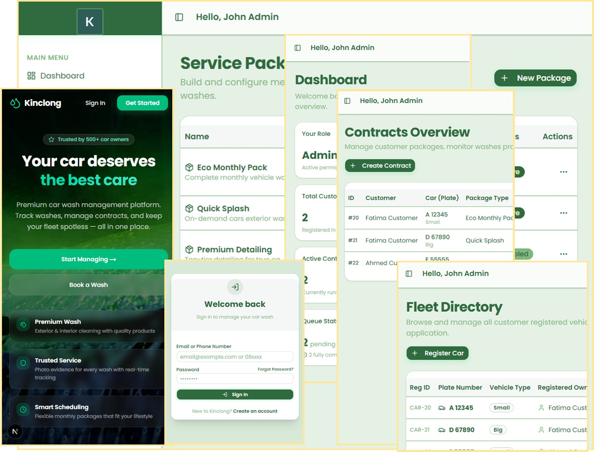

# Project : Kinclong
***************************************************************
Kinclong is a **mobile-first web application** designed to streamline car wash operations between:
- **Customers** (booking, tracking)
- **Staff** (managing tasks)
- **Admin** (overall management)


## Tech Stack

- **Framework:** Next.js
- **Database:** PostgreSQL
- **ORM:** Drizzle ORM
- **Styling:** TailwindCSS, Shadcn UI
- **Design Priority:** Mobile-first, responsive for desktop

## Getting Started

First, run the development server:

```bash
npm run dev
# or
yarn dev
# or
pnpm dev
# or
bun dev

//--PUSH DB in Drizzle:
//--1.Ensure Drizzle Kit Is Installed
//--Cara Rekomendasi:
npx drizzle-kit generate
npx drizzle-kit migrate
//--Cara Cepat:
npx drizzle-kit push

//--seed:
npm run db:seed
```

## Notes
- Started at: Week-3 of Mar26

## References:
- Random Images: [https://i.pravatar.cc/200](https://i.pravatar.cc/200)
- Random Images: [https://picsum.photos/200](https://picsum.photos/200)
- Color Ref: [Colors](https://coolors.co/palettes/trending)
- Svg Icon Collection: [SVG Icons](http://svgrepo.com)
- Github Emoji Collection (for Markdown): [Emoji](https://github.com/ikatyang/emoji-cheat-sheet)
- Emoji Collection (for HTML): [Emoji](https://html-css-js.com/html/character-codes/)
- Markdown Editor: https://pandao.github.io/editor.md/index.html
- Markdown to HTML: https://markdowntohtml.com
- Image to Text: https://www.imagetotext.info/

## Snapshot:
